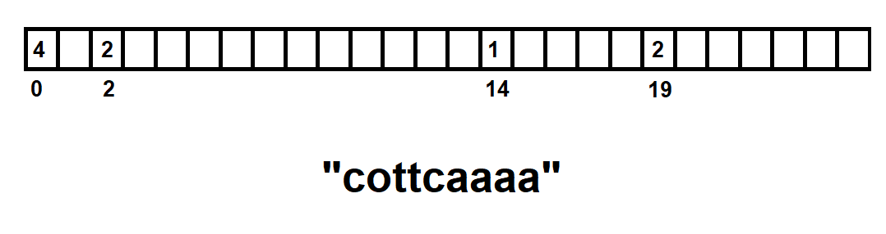
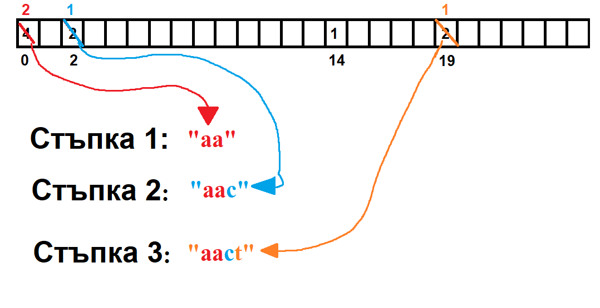
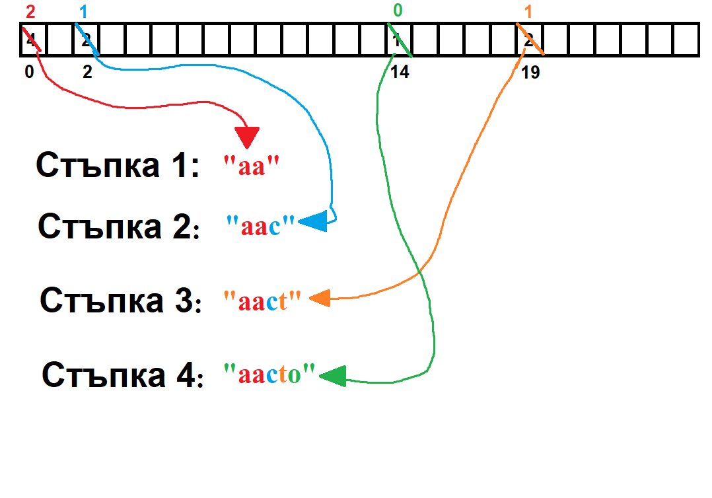
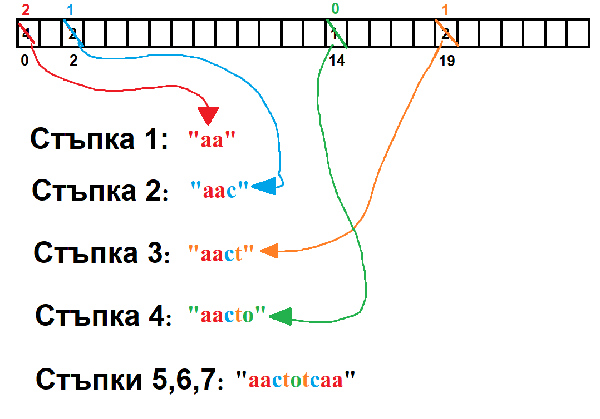

### Примерни решения на контролно 2

**Задача 1** - задачата е вече разглеждана на практикуми, под формата на 
[примерна задача от практикум 12](https://github.com/tkostadinov004/Introduction_to_programming_pract_FMI/blob/main/Pract%2012/generateSubsets_print.cpp).
Има два подхода за намиране на малките букви:
- може да минете през низа, да преброите колко са малките букви в него и да създадете динамично низ, в който да напълните малките букви
- може да минете през низа и директно да добавяте в някакъв масив, който е статично заделен, тъй като знаете, че малките букви ще бъдат най-много 31.

След това, с метода на побитовите маски, който сме обсъждали на практикуми, принтираме всички подмножества.  
Забележете, че ако подадения низ няма малки букви (тоест множеството от малки букви е празното множество), принтираме само празното множество, тъй като то е подмножество на всяко друго множество, 
включително и на себе си (аксиома за празното множество :))))  

**Задача 2** - подобно на [задача 3 от първото контролно](https://github.com/tkostadinov004/FMI-UP-mega/blob/main/K1/task3.cpp), няма нужда да се конкатенират двата низа. Идеята за решение е да пазим масив на срещанията на всеки символ в двата низа.
Това се постига лесно, знаейки, че низовете съдържат само малки латински букви, които са 26 на брой, по следната схема:
- 'a' ще бъде на индекс 0
- 'b' ще бъде на индекс 1
- ...
- 'z' ще бъде на индекс 25 

 

Ако имаме низ $`str`$, съставен само от малки латински букви и масив на срещанията $`occurrences`$, лесно се съобразява, че *occurrences [c - 'a']*
показва броят срещания на $`c`$ в $`str`$.  
В частност, ако имаме два низа $`str1`$ и $`str2`$, съставени само от малки латински букви и масив на срещанията $`occurrences`$, то *occurrences [c - 'a']*
показва броят срещания на $`c`$ в $`str1`$ и $`str2`$.   
На практикуми е разглеждан критерия за това един низ да може да образува палиндром, а именно: **да има най-много един символ с нечетен брой срещания**.
Например, *cottcaa* **може** да образува палиндром, защото има само 1 символ, който се среща нечетен брой пъти в него - 'o'.
 
    
*Пример за масива $`occurrences`$. Празните клетки имат стойност 0.*    
Образуваме палиндромния низ, ако той съществува, по следните 3 стъпки:
- итерираме целия масив на срещанията и долепваме към резултатния ни низ всеки символ $`ch`$, който се среща четен брой пъти, *occurrences [ch - 'a'] / 2*
  на брой пъти и делим срещанията му на две. 
- ако съществува символ, който се среща нечетен брой пъти, го долепваме колкото пъти се среща той и нулираме броя на срещанията му. Ако такъв няма, пропускаме тази стъпка. 
- итерираме целия масив на срещанията отзад-напред, за да симулираме огледалността, изисквана за един палиндром,
  и долепваме към резултатния ни низ всеки символ $`ch`$ *occurrences [ch - 'a']* на брой пъти. 

 

По такъв начин действително разделяме резултатния низ на 3 части (или 2, ако няма символ с нечетен брой срещания):
- лява част (LEFT)
- част, съставена от символът с нечетен брой срещания (ODD). Понеже ODD винаги ще съдържа само 1 символ $`n`$ на брой пъти, е гарантирано, че ODD е палиндром. Очевидно е, че всеки низ, съставен от $`n`$ на брой срещания на един и същ символ, е палиндром.
- дясна част, която е огледална на лявата (RIGHT)

