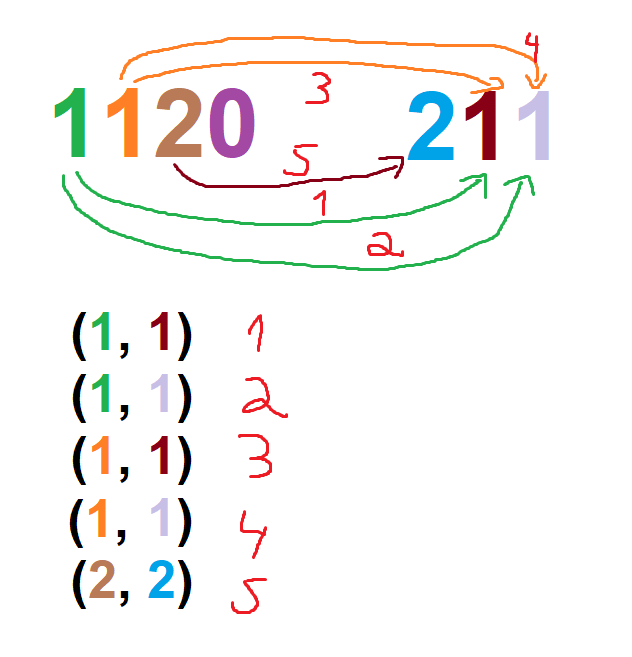

**Относно задача 1А:** Идеята беше да преброите една цифра по колко пъти се среща в първото и във второто число и да умножите двата резултата,
правейки това за всяка цифра от 0 до 9. Постановката на задачата прилича доста на задача за намиране на броя на елементите на декартово
произведение на две множества.   Ако имаме множеството $`A`$ с $`N`$ елемента и множеството $`B`$ с $`M`$ елемента, то
$`|A  \: \times  \: B| = |A| \times |B| = N \times M`$  
Левите множества ще са множествата от всички D-ци в първото число (които всъщност ще са мултимножества, понеже съдържат повтарящи се елементи), 
а десните множества ще са множествата от всички D-ци във второто число, където $`0 \le D \le 9`$.

