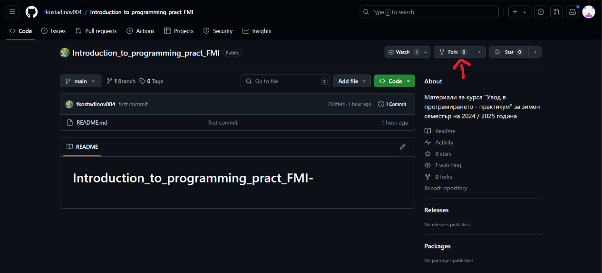
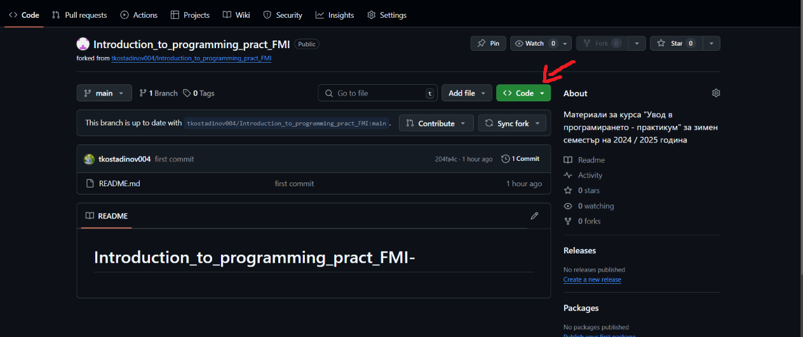
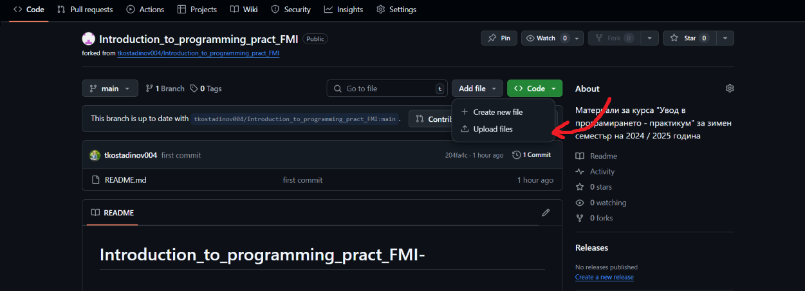
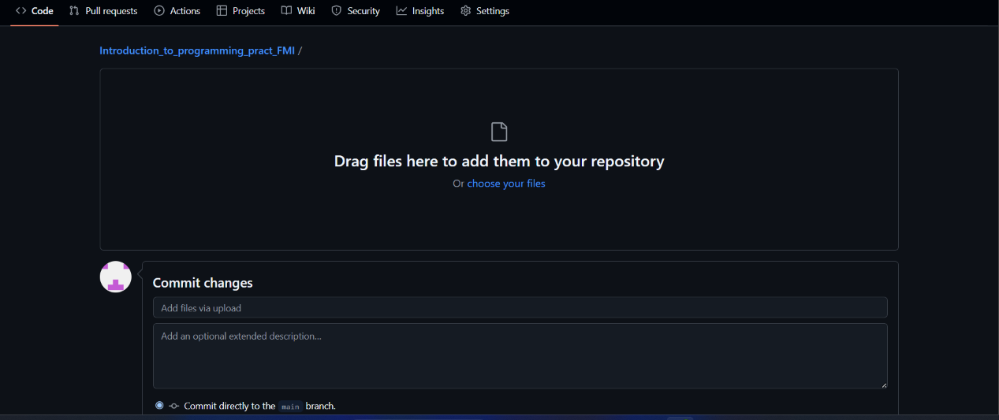
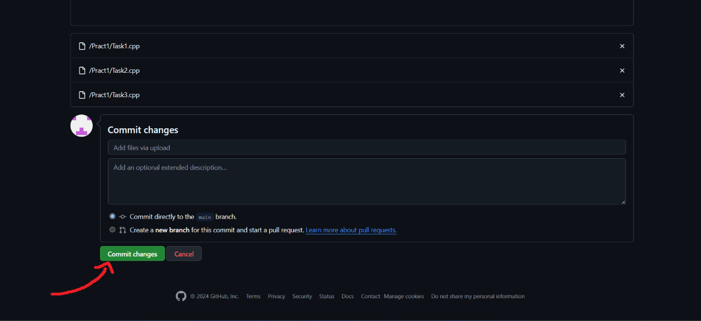
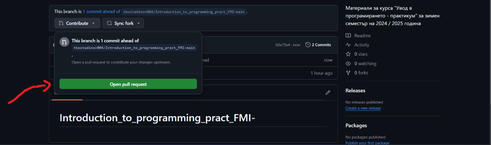
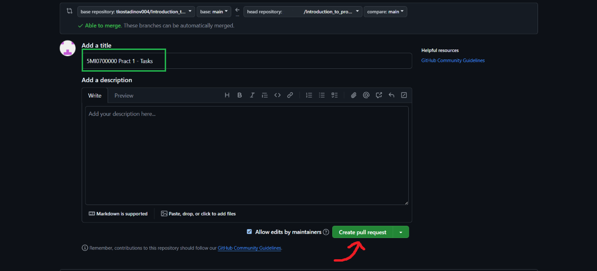

# Github workflow
1. Fork the repository
</br>




<br><br>


2. Commit the files
</br>



### Important!
- Create a cpp file for each task.
- **The name of the file should be TaskXX.cpp where XX is the number of the task**<br> e.g. Task01.cpp, Task12.cpp etc. 
- Copy your solution into the file.

</br>




<br><br>

3. Create a pull request
</br>



### Important!
The title of the pull request should be: 
```c++
<Faculty number> Pract X, Tasks K-N

Example:
5MI0700000 Pract 1, Tasks 1-5
```

</br>

The description of the pull request should be: 
```c++
<First name> <Last name>
<Group>

Example:
Ivan Ivanov
4
```

